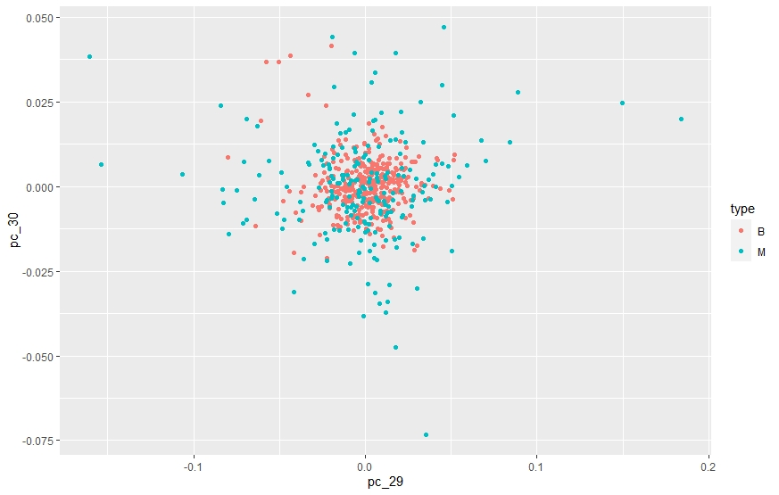
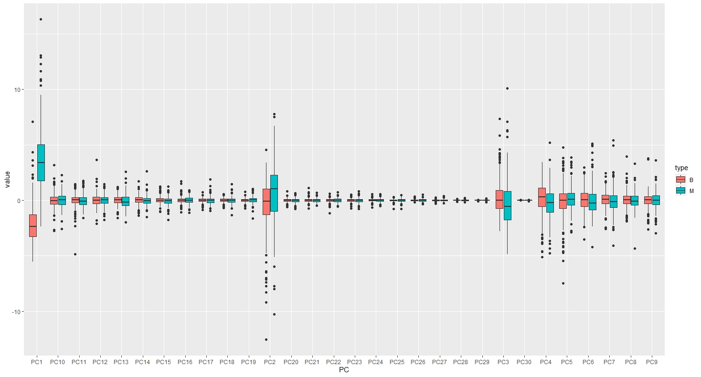
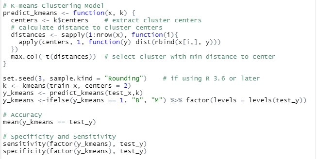
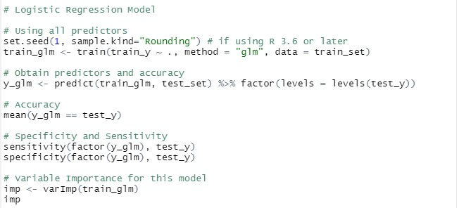
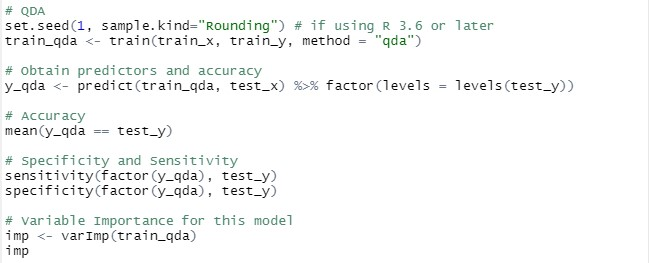

# Breast Cancer Diagnosis Biopsy Prediction

Machine Learning: Predicting Breast Cancer Diagnosis Using Multiple Techniques 
Tools: R (Dslabs, Caret, Tidyverse, MatrixStats, Gam) 
Data Source: Dslabs 
 

**CONTENT**
- Exploratory Data Analysis and Feature Selection
- Machine Learning Model Building / Training
-	Prediction / Accuracy

**EXPLORATORY DATA ANALYSIS AND FEATURE SELECTION**  
Before training and testing a machine learning model, it is important to understand the data to be used. This is the purpose of exploratory data analysis. 
The training dataset consist of 50 explanatory variables and 1 prediction variable describing if the tumors are benign (not cancer) or malignant (cancer). 
-	brca$y: a vector of sample classifications ("B" = benign or "M" = malignant)
-	brca$x: a matrix of numeric features describing properties of the shape and size of cell nuclei extracted from biopsy microscope image 

The first step to this analysis was to standardize and scale the matrix of numerical features and to calculate the distance between the tumor samples. 
This was done through the following steps;

By careful examination and preprocessing, relevant features were selected and used to train a model to predict the diagnosis of each tumor samples. In other to select the relevant features for prediction, it is important to identity features that do not have a strong correlation with each other. For the numerical variables, this was done by using a correlation heatmap

Visualizing the correlation between the numerical features using the correlation heatmap above, I decided to select 30 variables as they were the variables that were least correlated with each other. Furthermore, I also performed hierarchical clustering on the 30 features to determine their relationship.

Principal component analysis was performed on the scaled matrix showing the standard deviation, proportion of variance, and the cumulative proportion. The first and last two principal components were plotted in a scattered plot as well as a boxplot to show the relationship between themselves and the tumor type.

|  | PC1 | PC2 | PC3 | PC4 | PC5 | PC6 | PC7 | PC8 | PC9 | PC10 | PC11 | PC12 |
| --- | --- | --- | --- | --- | --- | --- | --- | --- | ---- | ---- | ---- | ---- |
| Standard Deviation | 3.644 | 2.386 | 1.6787 |	1.407 |	1.284 |	1.0988 |	0.8217 |	0.6904 |	0.6457 | 0.5922 | 0.5421 |	0.51104 |
| Proportion of Variance | 0.443 |	0.190 |	0.0939 |	0.066 |	0.055 |	0.0403 |	0.0225 |	0.0159 |	0.0139 | 0.0117 |	0.0098 |	0.00871 |
| Cumulative Proportion | 0.443 |	0.632 |	0.7264 |	0.792 |	0.847 |	0.8876 |	0.9101 |	0.9260 |	0.9399 | 0.9516 |	0.9614 |	0.97007 |

|  | PC13 | PC14 | PC15 | PC16 | PC17 | PC18 | PC19 | PC20 | PC21 | PC22 | PC23 |
| --- | --- | --- | --- | --- | --- | --- | --- | --- | ---- | ---- | ---- |
| Standard Deviation | 0.49128 |	0.39624 |	0.30681 |	0.28260 |	0.24372 |	0.22939 | 0.22244 |	0.17652 |	0.173 |	0.16565 |	0.15602 |
| Proportion of Variance | 0.00805 |	0.00523 | 0.00314 |	0.00266 |	0.00198 |	0.00175 | 0.00165 |	0.00104 |	0.001 |	0.00091 |	0.00081 |
| Cumulative Proportion | 0.97812 |	0.98335 |	0.98649 |	0.98915 |	0.99113 |	0.99288 | 0.99453 |	0.99557 |	0.997 |	0.99749 |	0.99830 |

|  | PC24 | PC25 | PC26 | PC27 | PC28 | PC29 | PC30 |
| --- | --- | --- | --- | --- | --- | --- | --- |
| Standard Deviation | 0.1344 |	0.12442 |	0.09043	| 0.08307 | 0.03987 |	0.02736	| 0.0115 |
| Proportion of Variance | 0.0006 |	0.00052 |	0.00027 |	0.00023 | 0.00005 |	0.00002 |	0.0000 |
| Cumulative Proportion | 0.9989 |	0.99942 |	0.99969	| 0.99992 | 0.99997 |	1.00000 |	1.0000 |

As shown in the figure above, we can see that Malignant tumors tend to have larger values of PC1 and PC2 than benign tumors.

As expected, we can see that both tumor samples behave similarly for PC29 and PC30 with values being closer to zero. The boxplot below shows similarity between the tumor type in almost all PCs except PC1 where there is no overlap in the interquartile ranges for both samples.

**MODEL PREDICTION**  
**K-means Clustering Model**

| MODEL | ACCURACY | SPECIFICITY | SENSITIVITY |
| --- | --- | --- | --- |
| K-means | 0.922 | 0.814 | 0.986 |

**Logistic Regression Model**

In terms of variable importance for this model, the top 5 most important variables used for the fit and prediction were;
-	Concave_pts_se (100%)
-	Compactness_mean (89.82%)
-	Radius_worst (82.56%)
-	Concavity_worst (74.48%)
-	Fractal_dim_se (72.10%)

| MODEL | ACCURACY | SPECIFICITY | SENSITIVITY |
| --- | --- | --- | --- |
| Logistic Regression | 0.957 | 0.977 | 0.944 |

**LDA Model**

In terms of variable importance for this model, the top 5 most important variables used for the fit and prediction were;
-	Perimeter_worst (100%)
-	Radius_worst (98.62%)
-	Area_worst (98.59%)
-	Concave_pts_worst (97.66%)
-	Concave_pts_mean (97.27%)

| MODEL | ACCURACY | SPECIFICITY | SENSITIVITY |
| --- | --- | --- | --- |
| LDA | 0.991 | 0.977 | 1.000 |

**QDA Model**

In terms of variable importance for this model, the top 5 most important variables used for the fit and prediction were;
-	Perimeter_worst (100%)
-	Radius_worst (98.62%)
-	Area_worst (98.59%)
-	Concave_pts_worst (97.66%)
-	Concave_pts_mean (97.27%)

| MODEL | ACCURACY | SPECIFICITY | SENSITIVITY |
| --- | --- | --- | --- |
| QDA | 0.957 | 0.930 | 0.972 |
